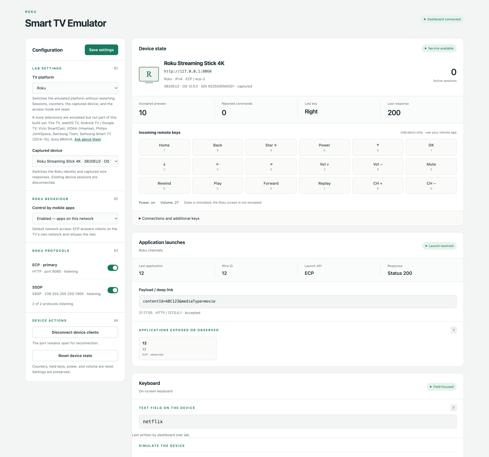
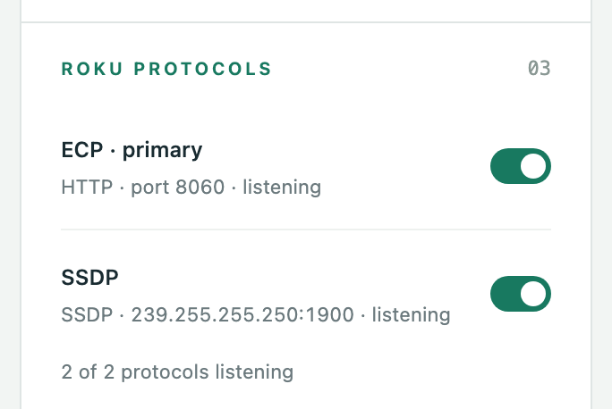
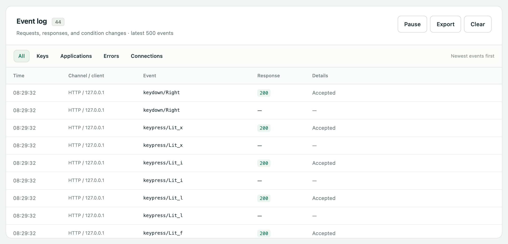

<h1 align="center">Smart TV Emulator</h1>

<p align="center">
  <b>Build and test a TV remote app for ten television platforms — without a single television in the office.</b>
</p>

<p align="center">
  
  <a href="LICENSE"></a>
  
  <!-- generated:badges -->
  
  
  
<!-- /generated -->
</p>

- **It answers like a real television.** SSDP and mDNS discovery, PIN and certificate
  pairing, and the actual wire protocols — ECP, SSAP, Turnstile, JointSpace, SmartCast,
  MQTT over TLS, `samsung.remote.control` — replayed from packet captures of physical
  hardware rather than written from a spec. Your app discovers it, pairs with it and
  controls it with no client-side test hooks.
- **It shows you what your app actually sent.** One local dashboard: live key presses,
  pairing state, one switch per protocol with its port and bind error, exact app-launch
  payloads, and a 500-event log you can export as JSONL and diff in CI.



<p align="center"><i>One Python process. The television is on your LAN; the dashboard is on 127.0.0.1.</i></p>

## Quick start

Needs Python 3.11+; the system Python 3.9 on macOS is too old. The easiest route is
[uv](https://docs.astral.sh/uv/), which fetches its own Python — no admin rights, no Homebrew:

```sh
curl -LsSf https://astral.sh/uv/install.sh | sh          # once, then open a new terminal
uvx --from git+https://github.com/evilutioner/smart-tv-emulator tvemu
```

Already have Python 3.11+? A venv works too:

```sh
python3 -m venv .venv && source .venv/bin/activate
pip install git+https://github.com/evilutioner/smart-tv-emulator
tvemu
```

Or from a local clone (inside the venv above; Homebrew's Python refuses it outside one):

```sh
git clone https://github.com/evilutioner/smart-tv-emulator && cd smart-tv-emulator
python -m pip install .
tvemu
```

The dashboard opens at <http://127.0.0.1:8888>, and `Device:` shows the LAN address the
emulator picked. Point your remote app there or just let it scan: it will find a
**Roku Streaming Stick 4K** running Roku OS 12.0.0. Keep the phone on the same network.

To pick the address yourself, add `--bind "$(ipconfig getifaddr en0)"` (the Mac's Wi-Fi
address). `uvx --refresh …` fetches the latest commit; `tvemu --help` lists every option.

## What is in this repository

The shared core, the whole dashboard, and the **Roku** adapter in full. Not a demo of a
product — one complete television:

- **ECP over HTTP** on port 8060, and the authenticated **`ecp-2` WebSocket**, including
  the challenge–response every Roku client performs before it sends anything.
- **SSDP `roku:ecp`**, answered with the captured header order.
- **All four network-access modes** the real *Control by mobile apps* setting offers, each
  reproducing that mode's wire behaviour rather than a flag in the UI.
- **Two captured devices**, switchable at runtime, with their real port maps and documents.
- The whole shared feature set: text input, application-launch observation, per-protocol
  switches, the event log and the complete `/api/v1` management API.

## Televisions and protocols

<!-- generated:televisions -->
| Television | In this build | Remote control | Discovery | Pairing | Captured devices |
|---|---|---|---|---|---|
| **[Roku](docs/platforms/roku.md)** | ✅ **Included** | ECP over HTTP **8060** + authenticated `ecp-2` WebSocket | SSDP `roku:ecp` | ECP-2 challenge–response | **Roku Streaming Stick 4K** — 3820EU2, Roku OS 12.0.0<br>**TCL Roku TV 32S357** — hw H104X, Roku OS 15.3.4 |
| **[Fire TV](docs/platforms/firetv.md)** | N/A | Turnstile over HTTPS **8080**; legacy ADB shell **5555**, off by default | DIAL/SSDP; Bonjour `_amzn-wplay._tcp` on Fire OS | On-screen PIN and client token; ADB public-key approval | **Fire TV Stick (Vega)** — AFTCA002, fw 2101020054720<br>**Fire TV Stick (Fire OS)** — AFTMA08C15, Fire OS 8.1.8.2 |
| **[webOS TV](docs/platforms/webos.md)** | N/A | SSAP over WSS **3001**, IME keyboard, pointer socket, DLNA renderer | SSDP from **four independent stacks**, each with its own UUID and ports | On-screen prompt, client key | **LG 43UQ81006LB**<br>**LG 50UA75006LA**<br>**Sencor SLE50Q871B**<br>**Sencor SLE65Q871B** |
| **[Android TV / Google TV](docs/platforms/androidtv.md)** | N/A | Remote v2 over mutual TLS **6466**; DIAL and Cast launch validation; AirPlay identity | Bonjour `_androidtvremote2._tcp`, `_googlecast._tcp`, `_airplay._tcp`; DIAL/SSDP | Polo pairing on **6467** — six hex characters and a client certificate | **Xiaomi MiTV-MOEU0** — fw 7.00.956317615<br>**TCL Android TV** — C06, AR2101<br>**KIVI Mediatek MTXXXX** (2 captures)<br>**Google Chromecast HD** — Google TV, Android 14<br>**Nokia Streaming Stick 800** — SEI Robotics, Android 11 |
| **[Vizio SmartCast](docs/platforms/vizio.md)** | N/A | SmartCast REST over HTTPS **7345** | DIAL/SSDP, description on **56790** | Four-digit PIN, then `AUTH_TOKEN` | **Vizio D24f-J09** — fw 3.3.3-2538.0001 |
| **[VIDAA (Hisense)](docs/platforms/vidaa.md)** | N/A | MQTT over TLS **36669** — keys, app and source lists, Live TV channels | **None.** The set answers no SSDP and no mDNS; a client reaches it by address after probing the UPnP description on **18400** | On-screen PIN, then access and refresh tokens | **Hisense 32A3HE** — VIDAA U7, fw V0007.09.60U.Q0609 |
| **[Philips JointSpace](docs/platforms/philips.md)** | N/A | JointSpace v6 over HTTPS **1926** and HTTP **1925** | SSDP/UPnP; Bonjour `_philipstv_rpc._tcp` | Four-digit PIN, then HTTP Digest | **Philips 32PHS6000/12** — JointSpace 6.1 |
| **[Samsung Tizen](docs/platforms/tizen.md)** | N/A | `samsung.remote.control` over WSS **8002**, base64 text input; device API **8001** | **None captured.** The sets run SSDP, but the ordered headers were never saved, so a client reaches them by address | On-screen Allow prompt, then an eight-digit token | **Samsung UE65U8072F** — 25_KSUE_UB<br>**Samsung UE55DU7172U** — 24_KANTSU2E_UB<br>**Samsung UE43CU7172U** — 23_KSUE_UB_T09 |
| **[Samsung Smart TV (2014–15)](docs/platforms/orsay.md)** | N/A | Encrypted Socket.IO 0.9 companion channel **8000**; multiscreen API **8001** | SSDP: four captured stacks, descriptions on **7676** | Four-digit on-screen PIN, then SPC key exchange on **8080** | **Samsung UE48H6200** — 14_X14, MSF 2.0.24 |
| **[Sony BRAVIA](docs/platforms/bravia.md)** | N/A | ScalarWebAPI JSON-RPC and IRCC over HTTP **80**; Simple IP Control **20060**; Android TV Remote **v1 only** over TLS **6466** | SSDP: four captured stacks; Bonjour `_androidtvremote._tcp` (no `_androidtvremote2`) | Four-digit PIN for an `auth` cookie; Polo v1 on **6467** — four hex symbols and a client certificate | **Sony KDL-55W807C** — BRAVIA 2015, Android 7.0<br>**Sony KDL-32WD600** — BRAVIA 2016, Linux; discoverable, no remote protocol |
<!-- /generated -->

**N/A** = written and tested against physical hardware, **not available in this build**. See
[The other televisions](#the-other-televisions). Version strings are the values
the captured firmware itself reports.

<details>
<summary><b>Protocol index</b> — every wire protocol the emulator speaks, and which television speaks it</summary>

| Wire protocol | Television | Transport · port | What is served |
|---|---|---|---|
| **ECP** (External Control Protocol) | Roku ✅ | HTTP 8060 | `keypress`/`keydown`/`keyup`, `launch`, captured UPnP and SCPD documents |
| **ecp-2** | Roku ✅ | WebSocket on 8060, subprotocol `ecp-2` | Challenge–response auth, serialized commands, device queries, ping/pong |
| **SSDP** `roku:ecp` | Roku ✅ | UDP 239.255.255.250:1900 | M-SEARCH replies in the captured header order |
| **Turnstile** | Fire TV · N/A | HTTPS 8080 | Amazon control API, PIN pairing, app launch; the port stays shut until a DIAL launch opens it |
| **ADB** (legacy shell) | Fire TV · N/A | TCP 5555 | `am start` / `monkey -p`, public-key authorization; off by default, as on a shipped stick |
| **DIAL** | Fire TV · N/A | HTTP 8009 | App state `GET`, launch `POST` |
| **UPnP `dd.xml`** | Fire TV · N/A | HTTP 60000 | The device description the DIAL search target points at |
| **Bonjour / mDNS** `_amzn-wplay._tcp` | Fire TV · N/A | UDP 5353, advertises 39187 | WhisperPlay registration with captured TXT records |
| **SSAP** | webOS · N/A | WSS 3001 | `register`, `ssap://` requests, subscriptions, IME keyboard, pointer input socket |
| **Second screen** UPnP | webOS · N/A | HTTP 1948 / 1382 / 1406 / 1102 | `urn:lge-com:service:webos-second-screen:1` description |
| **DIAL** | webOS · N/A | HTTP 1633 / 1209 / 1985 / 1475 | Device description and the `Application-URL` header |
| **DIAL apps** | webOS · N/A | HTTP 36866 | Captured per-application state documents |
| **DLNA MediaRenderer** | webOS · N/A | HTTP 1384 / 1431 / 1678 / 1175 | Description, SCPDs, and the volume and transport actions that move device state |
| **Virtual service** `urn:lge:device:tv:1` | webOS · N/A | HTTP 1998 / 1574 / 1708 / 1848 | The fourth description the set publishes |
| **SSDP** ×4 stacks | webOS · N/A | UDP 1900 | One reply per stack, each with its own UUID and `SERVER` header |
| **Android TV Remote Service v2** | Android TV · N/A | mutual TLS 6466 | Protobuf keys, IME text, state updates, voice, keepalive |
| **Wake service** | Android TV · N/A | TLS 6465 | Reproduces the captured certificate-rejection boundary |
| **Pairing v2** (Polo) | Android TV · N/A | mutual TLS 6467 | Six-hex on-screen code, client certificate exchange |
| **AirPlay** | Android TV · N/A | HTTP 7000 | Read-only `/info` identity |
| **Cast HTTP / DIAL** | Android TV · N/A | HTTP 8008, or 56790 on the KIVI sets | DIAL description, app root, Cast setup identity |
| **Google Cast** | Android TV · N/A | TLS 8009 | Receiver status and application launch |
| **Cast setup** | Android TV · N/A | HTTPS 8443 | Detailed setup identity |
| **Bonjour / mDNS** | Android TV · N/A | UDP 5353 | `_androidtvremote2._tcp`, `_googlecast._tcp`, `_airplay._tcp` with their live ports |
| **SmartCast REST** | Vizio · N/A | HTTPS 7345 | Pairing, device state, key commands, app launch |
| **UPnP `dd.xml`** | Vizio · N/A | HTTP 56790 | DIAL device description |
| **VIDAA MQTT/TLS** | VIDAA · N/A | MQTT over TLS 36669 | PIN pairing, access and refresh tokens, keys, app and source lists, broadcast state |
| **UPnP `dd.xml`** (`#CAP#`) | VIDAA · N/A | HTTP 18400 | The MediaRenderer description whose `#CAP#` block tells a client which credential dialect this firmware accepts |
| **JointSpace v6** | Philips · N/A | HTTPS 1926 | PIN pairing, Digest auth, control API |
| **JointSpace v6** | Philips · N/A | HTTP 1925 | Public version probes, authenticated `notifychange` |
| **UPnP MediaRenderer** | Philips · N/A | HTTP 49152 | Captured device description |
| **Cast wake** | Philips · N/A | HTTP 8008 | The wake endpoint used before a JointSpace power request |
| **Bonjour / mDNS** | Philips · N/A | UDP 5353 | `_philipstv_rpc._tcp` 1925, `_philipstv_s_rpc._tcp` 1926, `_googlecast._tcp` 8009 |
| **`samsung.remote.control`** | Tizen · N/A | WSS 8002 | Allow prompt and the eight-digit token, keys, base64 text input, installed-app list, `ed.apps.launch` |
| **Samsung device API** | Tizen · N/A | HTTP 8001 | Unauthenticated `/api/v2/` identity document, REST app launch |
| **DIAL description** | Tizen · N/A | HTTP 7678 | Captured receiver description with the `sec:` extensions |
| **SPC pairing** | Samsung 2014–15 · N/A | HTTP 8080 | DIAL `CloudPINPage`, the three-step PIN-keyed key exchange, session ids |
| **Samsung companion channel** | Samsung 2014–15 · N/A | Socket.IO 0.9 on 8000 | AES-128-ECB `callCommon` / `receiveCommon` events, `SendRemoteKey`, heartbeat |
| **Samsung multiscreen API** | Samsung 2014–15 · N/A | HTTP 8001 | `/ms/1.0/` and `/api/v2/` identity, application probe, launch and close |
| **Sony ScalarWebAPI** | Sony BRAVIA · N/A | HTTP 80 | JSON-RPC for identity, power, volume, inputs and applications; `actRegister` PIN registration and its cookie |
| **IRCC** | Sony BRAVIA · N/A | HTTP 80 | `X_SendIRCC` SOAP with the codes `getRemoteControllerInfo` lists |
| **Simple IP Control** | Sony BRAVIA · N/A | TCP 20060 | 24-byte frames for power, volume, mute, input and picture mute; notifications to every connection |
| **Android TV Remote v1** | Sony BRAVIA · N/A | TLS 6466 | Binary key and intent frames with the paired certificate |
| **Pairing v1** (Polo) | Sony BRAVIA · N/A | TLS 6467 | JSON Polo, four-hex on-screen code |

Also spoken, as part of the rows above: **UPnP/SSDP**, **DIAL**, **mDNS/Bonjour (DNS-SD)**,
**DLNA**, **Google Cast**, **AirPlay**, **Polo pairing**, **HTTP Digest**, **MQTT**,
**WebSocket**, **mutual TLS** and **ADB**.

</details>

## The other televisions

This repository is one complete television rather than a teaser: the Roku adapter here is
the same code everything else is built on, and so are the dashboard, the management API and
every shared feature.

The other televisions in the table are written too. Each was built against physical
hardware, each has its own captured profiles and its own regression tests, and each
implements the same descriptor contract you can read in
[`src/tvemu/platforms/base.py`](src/tvemu/platforms/base.py). They are not published in
this repository, so the dashboard lists them greyed out as `· N/A` — you can see what the
emulator covers before you go looking for it.

Between them they add Amazon's PIN and client token, LG's on-screen prompt and client key,
Android TV's Polo certificate exchange, Vizio's PIN and `AUTH_TOKEN`, VIDAA's access and
refresh tokens, Philips' PIN and HTTP Digest, Samsung's Allow prompt and eight-digit token,
Sony's PIN and auth cookie — plus the captured failures rather than only the happy path: the
Philips set that answers 404 for `powerstate`, the Fire TV that accepts a wrong PIN with
200, the Turnstile port that stays shut until a DIAL launch opens it.

Each has an overview under [`docs/platforms/`](docs/platforms): its protocols and ports, the
captured devices, the firmware behaviours a driver usually gets wrong, and what the emulator
lets you test. The full driver guides — every message, pairing step and refusal, tied to the
capture it came from — come with access to the emulator.

If one of them is what you actually need,
[open an issue](https://github.com/evilutioner/smart-tv-emulator/issues/new?template=television-request.yml)
and say which — it helps decide what comes next. Bugs in the Roku adapter and televisions
you own and want modelled are equally welcome.

## How it works

```text
src/tvemu/
  __main__.py                 CLI, network selection, process lifecycle
  core.py                     shared settings, device state, events, command results
  runtime.py                  platform lifecycle coordinator
  control.py                  local /api/v1 and dashboard server
  platforms/
    base.py                   adapter contract and platform descriptor
    __init__.py               registry, discovered from the packages in this directory
    catalogue.json            the televisions this product models, runnable here or not
    common/                   adapter, captured-profile, SSDP and mDNS behaviour shared by all
      evidence.py  ir.py        immutable captures, and the message structure derived from them
      claims.py  report.py      curated claims; contract check, OpenAPI and AsyncAPI export
    <platform>/               one television's wire protocols, and nothing else
      contract.py               this television's curated claims
      evidence/<capture-id>/    ordered wire exchanges and raw payload bytes, one per capture
      profiles/<device-id>/     a selectable device: one complete capture plus runtime values
  web/
    index.html  style.css  dom.js  app.js     shared shell; contains no television's name
    platforms/<platform>.js                   per-television panels, settings and key labels
```

**A television's name never appears in a shared file.** Differences between sets are
expressed as `PlatformDescriptor` data, a hook in `common/`, or a dashboard module — never
as `if platform == …`. Differences between two sets of the same brand are captured profile
data. That rule is what makes a build with one television and a build with eight the same
code.

The active television is runtime state, not a stored setting, so the dashboard switches it
without restarting: `Runtime.set_platform` stops the current listeners and discovery,
retargets shared state, builds the new adapter and starts it under the existing settings. A
switch that cannot bind restores the one that was serving.

`Runtime` never assumes HTTP. It asks the adapter to reconcile its protocols one at a time,
so an adapter may own aiohttp routes, raw TCP servers, TLS listeners, UDP sockets, mDNS
advertisements, or any combination — each behind its own switch.

`Core` owns protocol-independent state: events, connection summaries, key counters, held
keys, simulated power and volume, observed launches, and the access mode in force. An
access mode is declared data, not shared logic: it names the per-transport status for remote
keys, whether the protocol surface stays open, whether clients outside the device's subnet
are answered, and whether discovery still replies. A television whose firmware has no such
setting declares one always-on mode, and the dashboard states it as a read-only line instead
of offering a restriction the real set does not have.

Adding a television means a descriptor and an adapter implementing this lifecycle:

```python
def register_protocol(protocol_id: str, **listener) -> None: ...
async def start_protocol(protocol_id: str) -> None: ...
async def stop_protocol(protocol_id: str) -> None: ...
async def reconcile_protocols() -> dict[str, str]: ...   # protocol id -> bind error
async def warm_up(protocol_id: str) -> None: ...
async def stop_all() -> None: ...
async def disconnect() -> None: ...
```

## The contract

Drivers are written against this emulator, so its machine contract is evidence-first, built
in three layers:

```text
evidence/<capture-id>/     ordered wire exchanges and the original payload bytes, never edited
        │
        ▼
common/ir.py               message structure derived from those bytes: fields, native types,
        │                  XML names, attributes, order and repetition, opaque binary
        ▼
contract.py                small typed claims for what a capture cannot prove by itself
        │
        ├──▶ OpenAPI 3.2   HTTP, one document per port where two ports answer the same request
        └──▶ AsyncAPI 3.1  WebSocket and MQTT messages
```

A claim states semantic requiredness, a hand-written value set, a constraint, a serialization
quirk or conditional behaviour, and cites its own capture exchange, live probe or client
contract. Repetition across captures never makes a field required, and a required claim that a
later capture violates fails CI rather than being quietly relaxed.

OpenAPI and AsyncAPI are deterministic projections of that shared IR — never sources of truth
and never inputs to the emulator. The emulator replays captured bytes; it is not generated from
a schema, and a profile may change those bytes only at the runtime substitutions it declares.

```sh
tvemu --api-map roku                    # everything this television answers
tvemu --api-map roku --format openapi   # HTTP as OpenAPI 3.2
tvemu --api-map roku --format asyncapi  # WebSocket/MQTT as AsyncAPI 3.1
tvemu --contract roku                   # the curated claims and any disagreement
tvemu --contract roku --check           # merge gate: a claim the evidence contradicts fails
```


## The dashboard

- **Configuration** — the emulated television and the captured device it wears; the access
  modes that firmware offers; one switch per protocol the captured device exposes, with its
  wire family, port or multicast group, and live state (`listening`, `off`, `armed`, or the
  bind error that stopped it); forced disconnect and state reset.
- **State** — advertised address, connections, last button, button indicators and counters,
  power, volume, mute, keyboard and voice state, and the application catalogue plus the last
  observed launch.
- **Event log** — requests, transports, responses, rejection reasons, forced disconnects,
  resets, and JSONL export.



Each protocol starts and stops on its own: switching one off closes only its port and drops
only its sessions, and one that cannot bind is reported in its own row while the rest keep
serving. Only the primary protocol failing to bind is fatal.



## Management API

Served on the local dashboard port, independent of the selected television. Mutations
require `application/json`; browser requests with a foreign `Origin` or `Host` are rejected.

| Method | Path | Result |
|---|---|---|
| GET | `/api/v1/state` | Active television, device, settings and recent events |
| PATCH | `/api/v1/settings` | Apply a validated partial settings update |
| POST | `/api/v1/platform` | Switch the emulated television; body `{"platform": "<id>"}` |
| GET / WS | `/api/v1/events` | Initial and updated full snapshots |
| GET | `/api/v1/events/export` | Latest 500 events as JSONL |
| POST | `/api/v1/settings/save` | Persist current settings; body `{}` |
| POST | `/api/v1/actions/disconnect` | Terminate active clients; body `{}` |
| POST | `/api/v1/actions/reset` | Reset simulated device state; body `{}` |
| POST | `/api/v1/actions/clear-log` | Clear event entries; body `{}` |
| POST | `/api/v1/actions/text` | Type into the focused field |
| POST | `/api/v1/actions/field` | Focus or blur a field on the emulated device |
| GET | `/api/v1/openapi.json` | The declared shape of this API, including the snapshot |

Every event carries a monotonic id, UTC timestamp, kind, transport, client address,
operation, status, details and an optional protocol request id. Asking to switch to a
television this build does not include answers **501** with a machine-readable
`"reason": "n/a"`.

## Writing and testing a driver

The emulator is built to be the other end of a driver under development, for a person or a
coding agent:

- **Read the contract, not a blog post.** `docs/spec/` holds the OpenAPI and AsyncAPI
  exports of each shipped television, regenerated from the code and checked in CI;
  `tvemu --contract <id>` adds what the captures cannot prove.
- **Assert on what arrived.** `python -m tvemu.expect scenario.json` checks the event log
  against the events a step should produce and names the first one that did not come.
- **Let an agent close the loop.** `tvemu-mcp` is an MCP server (stdio, no extra
  dependencies) with `state`, `events`, `expect`, `reset`, `api_map`, `contract` and more, so
  an agent can change the driver, run the app and check the result itself:
  `claude mcp add tvemu -- tvemu-mcp`.
- **Run it in CI.** One process, loopback only: start it, run your tests, assert, keep the
  log as an artifact.

Start with [Writing a driver](docs/writing-a-driver.md) and [CI](docs/ci.md);
[`llms.txt`](llms.txt) indexes the repository for a model.

## Settings and captured profiles

Settings live in `.tvemu/settings.json`, relative to the launch directory. Dashboard changes
apply immediately in memory; **Save settings** writes them atomically for the next launch,
tagged with the television that was active. Files are `schema_version: 2`; an older file is
refused rather than migrated silently.

Selecting a captured device disconnects sessions tied to the previous identity, changes
subsequent protocol and SSDP responses, and restarts discovery. Neither the captured device
nor the access mode survives a television change — the arriving adapter resolves both to its
own defaults. The `protocols` map does survive, because a protocol id names the same wire
protocol everywhere and one the new television does not expose is simply never started.

A captured profile owns no raw response. Its `profile.json` references one complete capture
under `evidence/`, maps each replayed answer to an exchange in it, and lists the only runtime
substitutions a handler may make. Anything emulator-owned rather than measured — a token, a
representative list, a block inherited from a sibling set — sits in its `runtime` object with
its own provenance. An incomplete capture stays as evidence but is never selectable. No
capture in this repository carries a real device serial, UDN or hardware address.

## Adding a television

1. Create `src/tvemu/platforms/<id>/` and keep all wire-format code inside it.
2. Define a `PlatformDescriptor` with a stable id, default captured profile, protocol label,
   default port, native key set, transport ids, the access modes the firmware offers, and one
   `ProtocolSpec` per protocol it can serve.
3. Implement the adapter lifecycle from `platforms/base.py`, registering one
   `ProtocolListener` per protocol. Handlers return a declared reply or raise a wire error;
   they never build a response by hand.
4. Record each device under `evidence/<capture-id>/` — ordered exchanges, raw payloads and a
   `capture.json` whose `protocols` list names the ports that device used and which protocol
   is primary — then add a `profiles/<device-id>/profile.json` that references it.
5. Write `contract.py` with only the claims the captures cannot prove, each citing its
   provenance, and run `tvemu --contract <id> --check`.
6. Translate successful and rejected native commands into `Core.key()` calls and shared
   connection and event records.
7. Export `PLATFORM` and `ADAPTER` from the package — the registry finds it from there; no
   shared file lists televisions.
8. Add `web/platforms/<id>.js` for the controls that represent real test conditions, and add
   the television to `platforms/catalogue.json`.
9. Validate discovery, pairing, commands, failures, disconnects and recovery against both the
   target application and physical hardware.

A television need not be discoverable at all: the captured VIDAA set answers no SSDP or mDNS
search, so its descriptor declares no discovery protocol and its capture says so in
`platform.discovery`.

## What it does not do

It records commands and simulates observable state. It does not reproduce a television
operating system or render a screen. Deferred: complete captured application catalogues,
Cast and AirPlay media playback, speech recognition, several simultaneous virtual
televisions in one process, and IPv6.

## Development

```sh
python -m compileall -q src              # compiles
python -m unittest discover -s tests     # tests
tvemu --contract roku --check            # claims agree with every capture
python -m build                          # packages
```

Automated tests cover discovery, pairing and authentication, state queries, commands,
protocol isolation, profile fidelity and captured failure behaviour. The cross-cutting tests
name no television: they pick their platforms by declared capability, so the suite states the
same rules whatever a build ships.

What changed between versions is in [`CHANGELOG.md`](CHANGELOG.md).

## About the author

I'm **Oleg Marchik** ([@evilutioner](https://github.com/evilutioner)). For about the last
three years I have been writing Smart TV drivers: the code in a remote-control app that
discovers a television on the LAN, pairs with it and drives it. This emulator is the test 
bench that work needed: every television in the table is replayed from captures of physical
 hardware.

## Licence

Everything in this repository — the shared core, the dashboard, the management API, the MCP
server and the Roku adapter with its captures — is [Apache License 2.0](LICENSE): use it,
change it and ship it, commercially included. See [`NOTICE`](NOTICE).

The other televisions in the table are not in this repository and are not covered by this licence.
Access to them, a commercial agreement, or a driver built for your app:
[ask](https://github.com/evilutioner/smart-tv-emulator/issues/new?template=television-request.yml).
