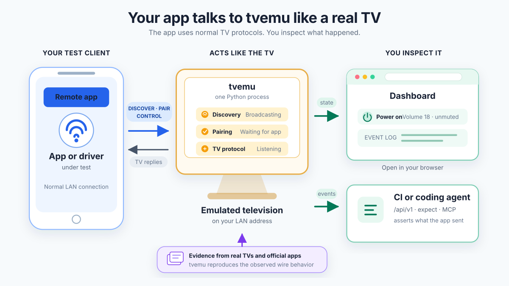
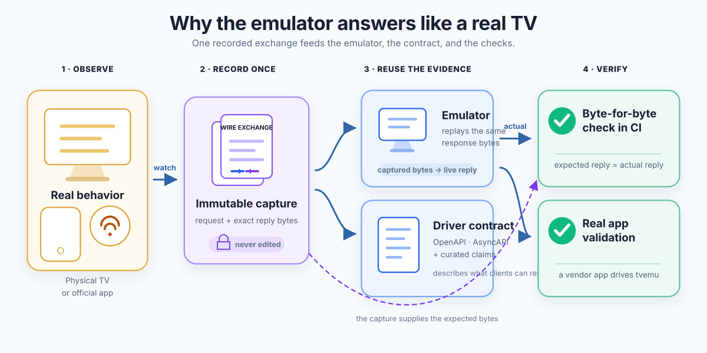

<h1 align="center">Smart TV Emulator</h1>

<p align="center">
  <b>Build and test a TV remote app without a television in the office.</b>
</p>

<p align="center">
  
  <a href="LICENSE"></a>
  
  <!-- generated:badges -->
  
  
  
  
  
<!-- /generated -->
</p>

A remote-control app has to find a television on the LAN, pair with it and drive it — and
every brand does each of those differently. This emulator is that television: one Python
process your app discovers, pairs with and controls exactly as it would a real set, with no
test hooks in the app. The answers are replayed from captures of physical hardware, and a
local dashboard shows you exactly what your app sent.

- **It answers like a real television.** SSDP and mDNS discovery, PIN and certificate
  pairing, and the real wire protocols — ECP, SSAP, Turnstile, JointSpace, SmartCast, MQTT
  over TLS, `samsung.remote.control` — including the firmware quirks and captured failures.
- **It shows what your app actually sent.** Live key presses, pairing state, one switch per
  protocol, exact app-launch payloads, and an event log you can export and assert on in CI.
- **It is a contract you can code against.** OpenAPI and AsyncAPI exports per television,
  a scenario checker over the event log, and an MCP server so a coding agent can close the
  loop itself.


## How it fits



## Quick start

Needs Python 3.11+ (the system Python 3.9 on macOS is too old). The easiest route is
[uv](https://docs.astral.sh/uv/), which fetches its own Python — no admin rights, no Homebrew:

```sh
curl -LsSf https://astral.sh/uv/install.sh | sh          # once, then open a new terminal
uvx --from git+https://github.com/evilutioner/smart-tv-emulator tvemu
```

<details>
<summary>With your own Python 3.11+, or from a clone</summary>

```sh
python3 -m venv .venv && source .venv/bin/activate
pip install git+https://github.com/evilutioner/smart-tv-emulator
tvemu
```

From a local clone (inside the venv above; Homebrew's Python refuses it outside one):

```sh
git clone https://github.com/evilutioner/smart-tv-emulator && cd smart-tv-emulator
python -m pip install .
tvemu
```

</details>

The dashboard opens at <http://127.0.0.1:8888>, and `Device:` shows the LAN address the
emulator picked. Keep the phone on the same network and let your app scan: it finds a
**TCL Roku TV 32S357** running Roku OS 15.3.4. To pick the address yourself, add
`--bind "$(ipconfig getifaddr en0)"`; `tvemu --help` lists every option.

## Televisions

<!-- generated:televisions -->
| Television | What it speaks | Devices | Tested with |
|---|---|---|---|
| **[Roku](docs/platforms/roku.md)**<br>**Included** | ECP over HTTP · authenticated ecp-2 WebSocket · SSDP roku:ecp | 📡 **Roku Streaming Stick 4K**<br>📡 **TCL Roku TV 32S357** | 🧪 [rokuecp](https://github.com/ctalkington/python-rokuecp) · [report](docs/clients/roku.md#rokuecp)<br>🧪 [python-roku](https://github.com/jcarbaugh/python-roku) · [report](docs/clients/roku.md#python-roku)<br>🧪 [roku-client](https://github.com/bschlenk/node-roku-client) · [report](docs/clients/roku.md#roku-client)<br>🔬 [unit and replay tests](docs/tests/roku.md) |
| **[Fire TV](docs/platforms/firetv.md)**<br>N/A | Turnstile over HTTPS · legacy ADB shell · DIAL and SSDP · Bonjour on Fire OS | 📡✅ **Fire TV Stick (Vega)**<br>📡✅ **Fire TV Stick (Fire OS)** | ✅ [Amazon Fire TV for iOS](https://apps.apple.com/app/id947984433) · [report](docs/manual-validation.md#ledger)<br>🔬 [unit and replay tests](docs/tests/firetv.md) |
| **[webOS TV](docs/platforms/webos.md)**<br>N/A | SSAP over WSS · IME keyboard · pointer socket · DLNA renderer · four SSDP stacks | 📡 **LG 43UQ81006LB**<br>📡 **LG 50UA75006LA**<br>📡 **Sencor SLE50Q871B**<br>📡 **Sencor SLE65Q871B** | 🔬 [unit and replay tests](docs/tests/webos.md) |
| **[Android TV / Google TV](docs/platforms/androidtv.md)**<br>N/A | Remote v2 over mutual TLS · Polo pairing · Cast and DIAL launch · AirPlay identity · Bonjour | 📡✅ **Xiaomi MiTV-MOEU0**<br>📡 **TCL Android TV**<br>📡 **KIVI Mediatek MTXXXX** (2 captures)<br>📡✅ **Google Chromecast HD**<br>📡 **Nokia Streaming Stick 800** | ✅ [Google TV for iOS](https://apps.apple.com/app/id746894884) · [report](docs/manual-validation.md#ledger)<br>🧪 [androidtvremote2](https://github.com/tronikos/androidtvremote2) · [report](docs/clients/androidtv.md#androidtvremote2)<br>🔬 [unit and replay tests](docs/tests/androidtv.md) |
| **[Vizio SmartCast](docs/platforms/vizio.md)**<br>N/A | SmartCast REST over HTTPS · DIAL and SSDP | 📡 **Vizio D24f-J09** | 🔬 [unit and replay tests](docs/tests/vizio.md) |
| **[VIDAA (Hisense)](docs/platforms/vidaa.md)**<br>N/A | MQTT over TLS · UPnP capability probe · Live TV channel list | 📡 **Hisense 32A3HE** | 🔬 [unit and replay tests](docs/tests/vidaa.md) |
| **[Philips JointSpace](docs/platforms/philips.md)**<br>N/A | JointSpace v6 over HTTPS and HTTP · UPnP · SSDP · Bonjour | 📡✅ **Philips 32PHS6000/12** | ✅ [Philips TV Remote for iOS](https://apps.apple.com/gb/app/philips-smart-tv/id1479155903) · [report](docs/manual-validation.md#ledger)<br>🔬 [unit and replay tests](docs/tests/philips.md) |
| **[Samsung Tizen](docs/platforms/tizen.md)**<br>N/A | samsung.remote.control over WSS · device API · DIAL description | 📡 **Samsung UE65U8072F**<br>📡 **Samsung UE55DU7172U**<br>📡 **Samsung UE43CU7172U** | 🔬 [unit and replay tests](docs/tests/tizen.md) |
| **[Samsung Smart TV (2014–15)](docs/platforms/orsay.md)**<br>N/A | SPC PIN pairing · encrypted Socket.IO companion channel · multiscreen API · SSDP | 📡 **Samsung UE48H6200** | 🔬 [unit and replay tests](docs/tests/orsay.md) |
| **[Sony BRAVIA](docs/platforms/bravia.md)**<br>N/A | ScalarWebAPI JSON-RPC · IRCC · Simple IP Control · PIN registration · Android TV Remote v1 · SSDP · Bonjour | 📡 **Sony KDL-55W807C**<br>📡 **Sony KDL-32WD600** | 🔬 [unit and replay tests](docs/tests/bravia.md) |
| **[Metz Classic](docs/platforms/metz.md)**<br>N/A | RCRService SOAP over HTTP · SSDP upnp:rootdevice · modelled from the MetzRemote app | 📱 **Metz Classic** | 🔬 [unit and replay tests](docs/tests/metz.md) |
| **[TCL nScreen](docs/platforms/nscreen.md)**<br>N/A | nScreen XML remote over TCP · DLNA renderer · DIAL · SSDP, two stacks | 📡 **TCL H32S5916** | 🔬 [unit and replay tests](docs/tests/nscreen.md) |
| **[Panasonic VIERA](docs/platforms/viera.md)**<br>N/A | NRC SOAP over HTTP, plain or PIN-paired and encrypted · volume, inputs and events · pointer and gamepad socket · driven by Panasonic TV Remote 2 and 3 | 📱✅ **Panasonic VIERA, no PIN**<br>📱✅ **Panasonic VIERA, PIN** | ✅ [Panasonic TV Remote 3 for iOS](https://apps.apple.com/app/id1435893441) · [report](docs/manual-validation.md#ledger)<br>✅ [Panasonic TV Remote 2 for iOS](https://apps.apple.com/app/id590335696) · [report](docs/manual-validation.md#ledger)<br>🔬 [unit and replay tests](docs/tests/viera.md) |
<!-- /generated -->

📡 **Captured** — replayed from packet captures of a physical set ·
📱 **Modelled** — built from the vendor's own remote app, no set measured ·
✅ **Validated** — the vendor's own remote app was driven against it by hand
([ledger](docs/manual-validation.md)) ·
🧪 **Exercised** — an open-source client library runs against it every week
([clients](docs/open-source-clients.md)) ·
🔬 **Tested** — our own unit tests and a byte-for-byte replay of every capture, reported per
television ·
**N/A** — written and tested, [not in this build](#the-other-televisions).

Ports, discovery, pairing, firmware versions and every wire protocol by television:
[Televisions and protocols](docs/televisions.md).

## Why you can trust the answers



- **Bytes, not a schema.** The emulator serves the captured bytes and changes them only at
  substitutions a profile declares (a token, a session id). The OpenAPI and AsyncAPI files
  are derived from the same captures, never the other way round.
- **Checked on every commit.** A replay harness sends each captured request to the running
  emulator and compares the answer with the capture byte for byte; a claim the evidence
  contradicts fails the build.
- **Honest about provenance.** Each device says whether it was captured from a set or
  modelled from an app, and a device is called *validated* only after a session with a real
  app — never on the strength of tests we wrote.
- **Driven by the clients people use.** The vendors' own remote apps, by hand; and
  open-source libraries — such as [rokuecp](docs/clients/roku.md), the one behind Home
  Assistant's Roku integration — installed untouched and re-run every week. What they ask
  for that no capture answers is listed, never invented.

The details: [Architecture](docs/architecture.md#the-contract).

## Writing and testing a driver

- **Read the contract, not a blog post.** [`docs/spec/`](docs/spec) holds the OpenAPI and
  AsyncAPI exports of each shipped television; `tvemu --contract <id>` adds what the captures
  cannot prove.
- **Assert on what arrived.** `python -m tvemu.expect scenario.json` checks the event log
  against what a step should produce and names the first event that did not come.
- **Let an agent close the loop.** `claude mcp add tvemu -- tvemu-mcp` gives a coding agent
  `state`, `events`, `expect`, `reset`, `api_map`, `contract` and more.
- **Run it in CI.** One process, loopback only: start it, run your tests, keep the log.
- **See which open-source clients work with it.** Upstream libraries are installed in
  isolation and run against the emulator, every run kept as a record:
  [Open-source clients](docs/open-source-clients.md).

Start with [Writing a driver](docs/writing-a-driver.md), then [CI](docs/ci.md) and
[Dashboard and management API](docs/dashboard-and-api.md).

## The other televisions

This repository is one complete television, not a demo: the **Roku** adapter — ECP over HTTP,
the authenticated `ecp-2` WebSocket, SSDP, all four *Control by mobile apps* modes and two
captured devices — runs on the same shared core, dashboard and API as every other one.

The televisions marked **N/A** are written too. Each was built against physical hardware or
the vendor's own app, has its own profiles and regression tests, and is shown greyed out in
the dashboard so you can see what the emulator covers. Each has an overview under
[`docs/platforms/`](docs/platforms); the full driver guides — every message, pairing step and
refusal, tied to the capture it came from — come with access.

If one of them is what you need, [get in touch](https://marchik.dev) and say which. Bugs in the
Roku adapter, and televisions you own and want modelled, are welcome as
[issues](https://github.com/evilutioner/smart-tv-emulator/issues).

## Limits

It records commands and simulates observable state; it does not run a television operating
system or render a screen. Not yet: complete application catalogues, Cast and AirPlay media
playback, speech recognition, several televisions in one process, and IPv6.

## More

[Architecture](docs/architecture.md) — how it works, the contract, replay conformance, adding
a television · [Televisions and protocols](docs/televisions.md) ·
[Dashboard and API](docs/dashboard-and-api.md) · [Manual validation](docs/manual-validation.md) ·
[Open-source clients](docs/open-source-clients.md) ·
[Changelog](CHANGELOG.md) · [`llms.txt`](llms.txt) for a model

## About the author

I'm **Oleg Marchik** ([@evilutioner](https://github.com/evilutioner)). For about the last
three years I have been writing Smart TV drivers: the code in a remote-control app that
discovers a television on the LAN, pairs with it and drives it. This emulator is the test
bench that work needed.

## Licence

Everything in this repository — the shared core, the dashboard, the management API, the MCP
server and the Roku adapter with its captures — is [Apache License 2.0](LICENSE): use it,
change it and ship it, commercially included. See [`NOTICE`](NOTICE).

The other televisions in the table are not in this repository and are not covered by this
licence. Access to them, a commercial agreement, or a driver built for your app:
[get in touch](https://marchik.dev).
