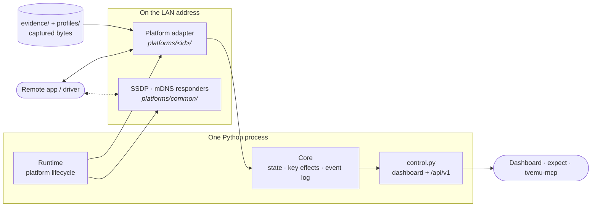
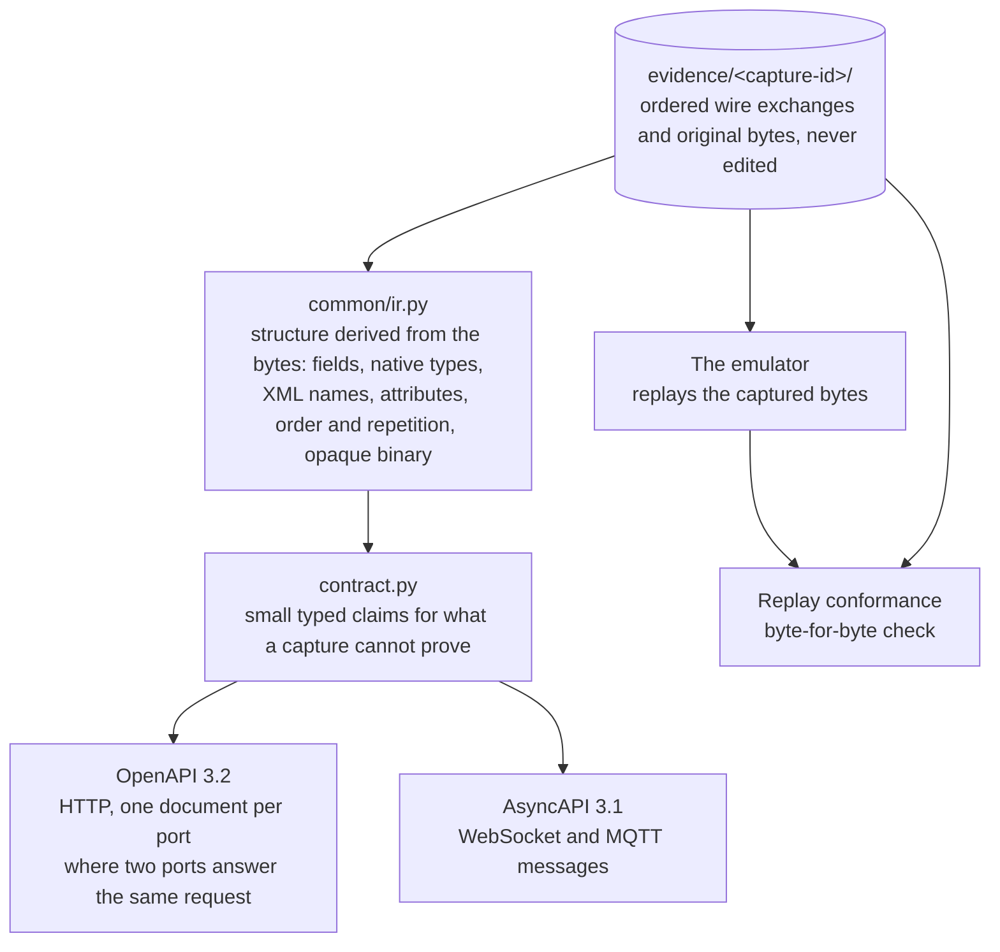

# Architecture

How the emulator is put together, for anyone changing it rather than driving it. To write a
driver against it, start with [Writing a driver](writing-a-driver.md) instead.



## Layout

```text
src/tvemu/
  __main__.py                 CLI, network selection, process lifecycle
  core.py                     shared settings, device state, events, command results
  runtime.py                  platform lifecycle coordinator
  control.py                  local /api/v1 and dashboard server
  platforms/
    base.py                   adapter contract and platform descriptor
    __init__.py               registry, discovered from the packages in this directory
    catalogue.json            the televisions this product models, runnable here or not
    common/                   adapter, captured-profile, SSDP and mDNS behaviour shared by all
      evidence.py  ir.py        immutable captures, and the message structure derived from them
      claims.py  report.py      curated claims; contract check, OpenAPI and AsyncAPI export
    <platform>/               one television's wire protocols, and nothing else
      contract.py               this television's curated claims
      evidence/<capture-id>/    ordered wire exchanges and raw payload bytes, one per capture
      profiles/<device-id>/     a selectable device: one complete capture plus runtime values
  web/
    index.html  style.css  dom.js  app.js     shared shell; contains no television's name
    platforms/<platform>.js                   per-television panels, settings and key labels
```

## The one rule

**A television's name never appears in a shared file.** Differences between sets are
expressed as `PlatformDescriptor` data, a hook in `common/`, or a dashboard module — never
as `if platform == …`. Differences between two sets of the same brand are captured profile
data. That rule is what makes a build with one television and a build with eight the same
code.

## Runtime

The active television is runtime state, not a stored setting, so the dashboard switches it
without restarting: `Runtime.set_platform` stops the current listeners and discovery,
retargets shared state, builds the new adapter and starts it under the existing settings. A
switch that cannot bind restores the one that was serving.

`Runtime` never assumes HTTP. It asks the adapter to reconcile its protocols one at a time,
so an adapter may own aiohttp routes, raw TCP servers, TLS listeners, UDP sockets, mDNS
advertisements, or any combination — each behind its own switch.

`Core` owns protocol-independent state: events, connection summaries, key counters, held
keys, simulated power and volume, observed launches, and the access mode in force. An
access mode is declared data, not shared logic: it names the per-transport status for remote
keys, whether the protocol surface stays open, whether clients outside the device's subnet
are answered, and whether discovery still replies. A television whose firmware has no such
setting declares one always-on mode, and the dashboard states it as a read-only line instead
of offering a restriction the real set does not have.

An adapter implements this lifecycle:

```python
def register_protocol(protocol_id: str, **listener) -> None: ...
async def start_protocol(protocol_id: str) -> None: ...
async def stop_protocol(protocol_id: str) -> None: ...
async def reconcile_protocols() -> dict[str, str]: ...   # protocol id -> bind error
async def warm_up(protocol_id: str) -> None: ...
async def stop_all() -> None: ...
async def disconnect() -> None: ...
```

## The contract

Drivers are written against this emulator, so its machine contract is evidence-first, built
in three layers:



A claim states semantic requiredness, a hand-written value set, a constraint, a serialization
quirk or conditional behaviour, and cites its own capture exchange, live probe or client
contract. Repetition across captures never makes a field required, and a required claim that a
later capture violates fails CI rather than being quietly relaxed.

OpenAPI and AsyncAPI are deterministic projections of that shared IR — never sources of truth
and never inputs to the emulator. The emulator replays captured bytes; it is not generated from
a schema, and a profile may change those bytes only at the runtime substitutions it declares.

```sh
tvemu --api-map roku                    # everything this television answers
tvemu --api-map roku --format openapi   # HTTP as OpenAPI 3.2
tvemu --api-map roku --format asyncapi  # WebSocket/MQTT as AsyncAPI 3.1
tvemu --contract roku                   # the curated claims and any disagreement
tvemu --contract roku --check           # merge gate: a claim the evidence contradicts fails
```

## Replay conformance

The contract check proves the claims agree with the captures; it does not prove the emulator
actually serves those bytes. The replay conformance harness does. It starts the real adapter
of each captured profile, binds its listeners on loopback while the profile keeps advertising
its captured address and ports, sends the captured client request over a real socket, and
compares the answer with the capture byte for byte: status, every captured header, and the
body. A difference passes only inside a runtime substitution the profile declares, and every
case must leave no listener, socket or task behind.

```sh
python -m tvemu.conformance --all --list     # the cases, and every replay not yet covered
python -m tvemu.conformance --platform <id>  # run one television's cases
python -m tvemu.conformance --all --json-report conformance.json
```

A replay nothing verifies is never skipped: it is listed as uncovered with its reason — a
transport with no driver yet, or a capture that kept no client frame — and the run stays red
until it is covered. HTTP, HTTPS, WebSocket and MQTT run today; raw TCP comes next.

A captured request rarely stands alone. It went to a paired route, or it carries a token or
a PIN the capture wrote as `{token}`, because the value belonged to the client. A television
says how a fresh adapter reaches that state in `platforms/<id>/conformance/`:

- **setup hooks** (`SETUPS`, `setup()`; `tvemu/conformance/setup.py`) pair over the real
  listeners, read the PIN off the screen the dashboard renders, and return the headers and
  placeholder values the captured request is then sent with. A profile names a hook for one
  exchange under `setup` in its conformance data; the platform's `DEFAULT_SETUP` serves every
  paired route and placeholder otherwise.
- **MQTT scripts** (`MQTT`, `mqtt_values()`; `tvemu/conformance/mqtt.py`) list the captured
  exchanges a replay needs before it, each on a named client session, so a query runs on a
  session that paired and subscribed exactly as the captured client did, and a token is
  presented on a second connection.
- **WebSocket channels** (`CHANNELS`, `materialise()`; `tvemu/conformance/websocket.py`) give
  the upgrade path, the opening exchanges and the values recomputed per session.
- **embedded** documents, which the set carried as a string inside another answer, are
  compared out of that field of their parent's answer.

Every step on the way is compared as well, so a hook that passes proves the pairing too. A
hook never calls a handler or sets adapter state directly.

CI runs one conformance job per television with `--gate`: a failed case always fails the
build, and an uncovered replay fails it only for a television whose conformance package
declares `COVERAGE = "complete"`, so full coverage, once reached, cannot quietly erode.

## Settings and captured profiles

Settings live in `.tvemu/settings.json`, relative to the launch directory. Dashboard changes
apply immediately in memory; **Save settings** writes them atomically for the next launch,
tagged with the television that was active. Files are `schema_version: 2`; an older file is
refused rather than migrated silently.

Selecting a captured device disconnects sessions tied to the previous identity, changes
subsequent protocol and SSDP responses, and restarts discovery. Neither the captured device
nor the access mode survives a television change — the arriving adapter resolves both to its
own defaults. The `protocols` map does survive, because a protocol id names the same wire
protocol everywhere and one the new television does not expose is simply never started.

A captured profile owns no raw response. Its `profile.json` references one complete capture
under `evidence/`, maps each replayed answer to an exchange in it, and lists the only runtime
substitutions a handler may make. Anything emulator-owned rather than measured — a token, a
representative list, a block inherited from a sibling set — sits in its `runtime` object with
its own provenance. An optional `label` names the profile in the dashboard's device picker,
so two devices of one product line read differently. An incomplete capture stays as evidence
but is never selectable. No capture in this repository carries a real device serial, UDN or
hardware address.

## Adding a television

1. Create `src/tvemu/platforms/<id>/` and keep all wire-format code inside it.
2. Define a `PlatformDescriptor` with a stable id, default captured profile, protocol label,
   default port, native key set, transport ids, the access modes the firmware offers, and one
   `ProtocolSpec` per protocol it can serve.
3. Implement the adapter lifecycle from `platforms/base.py`, registering one
   `ProtocolListener` per protocol. Handlers return a declared reply or raise a wire error;
   they never build a response by hand.
4. Record each device under `evidence/<capture-id>/` — ordered exchanges, raw payloads and a
   `capture.json` whose `protocols` list names the ports that device used and which protocol
   is primary — then add a `profiles/<device-id>/profile.json` that references it.
5. Write `contract.py` with only the claims the captures cannot prove, each citing its
   provenance, and run `tvemu --contract <id> --check`.
6. Translate successful and rejected native commands into `Core.key()` calls and shared
   connection and event records.
7. Export `PLATFORM` and `ADAPTER` from the package — the registry finds it from there; no
   shared file lists televisions.
8. Add `web/platforms/<id>.js` for the controls that represent real test conditions, and add
   the television to `platforms/catalogue.json` — a device built from a vendor app rather than
   a set is `"modelled": true`, and one a real app has been driven against (a row in
   [Manual validation](manual-validation.md)) is `"validated": true`. Then run
   `python tools/render_docs.py`, which writes the README's table and badges and
   [Televisions](televisions.md) from the catalogue.
9. Validate discovery, pairing, commands, failures, disconnects and recovery against both the
   target application and physical hardware.

A television need not be discoverable at all: the captured VIDAA set answers no SSDP or mDNS
search, so its descriptor declares no discovery protocol and its capture says so in
`platform.discovery`.

## Development

```sh
python -m compileall -q src               # compiles
python -m unittest discover -s tests      # tests
tvemu --contract roku --check             # claims agree with every capture
python -m tvemu.conformance --all --gate  # the emulator serves those captures, byte for byte
python tools/render_docs.py --check       # generated docs are up to date
python -m build                           # packages
```

Automated tests cover discovery, pairing and authentication, state queries, commands,
protocol isolation, profile fidelity and captured failure behaviour. The cross-cutting tests
name no television: they pick their platforms by declared capability, so the suite states the
same rules whatever a build ships.
